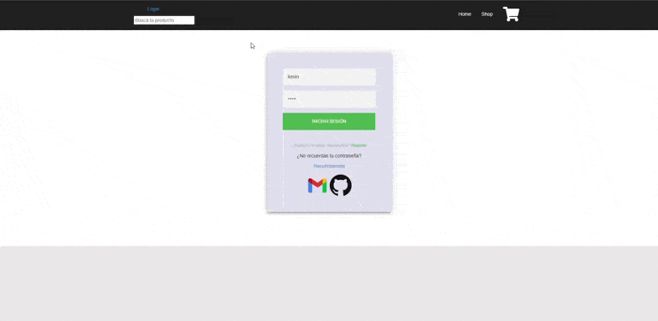

## Table of Contents
1. [FilmaWeb](#FilmaWeb)
2. [Estado](#Estado)
3. [Funciones](#Funciones)
4. [Tecnologías Empleadas](#Tecnologías-empleadas)
5. [Librerías Empleadas](#Librerías-empleadas)

# FilmaWeb!

_Bienvenidas y bienvenidos a FilmaWeb_ 

¿Qué es filmaWeb-FW_PHP_OO_MVC_AngularJS1.4? 

FilmaWeb es el útlimo proyecto con Framework PHP, AngularJS, y CSS entre otros del alumno de 1º de DAW "Kevin Camós" migrada tanto desde en backend de PHP a un Framework de PHP y desde el frontend de JQuery a AngularJS.

Filmaweb también es una cercana y sencilla web para el usuario medio donde comprar films. 

## Estado 👾

Finalizado! 👨‍💻

## Funciones

La web está compuesta con las siguientes funcionalidades:

1. __Toda la web:__ 
Al largo de la web tenemos algunas funciones que se pueden realizar desde cualquier ventana
  * Search/Buscador de productos
  * Contador de productos en el carrito

2. __Home:__ 
En la ventana Home el usuario tiene su primera impresión de la tienda, el cual puede observar un filtro por categorías o un scroll de productos, entre otros.
  * Carousel de categorías con salto de página
  * Scroll de productos con salto de página

3. __Shop:__ 
La tienda de la web es la parte más importante de la web, en la cual el cliente puede filtrar el producto deseado, ver los detalles del producto o ver en qué tiendas se encuentra disponible ahora mismo, entre muchas otras cosas.

  * Listado de productos
  * Filtrar productos
  * Paginación
  * Favoritos
  * Añadir al carrito

3. __LogIn:__ 
En el modulo de LogIn el usuario puede registrarse, conectarse a su cuenta, o modificar su contraseña si se le ha olvidado.

  * Registro
  * LogIn
  * Social LogIn mediante Gmail y Github mediante Firebase
  * Recordar contraseña mediante correo de verificación
  * Validar nuevos usuarios mediante correo de verificación

Además el login tiene un token mediante JWT en el que va verificando durante el uso de la web si el usuario conectado realmente es él.

4. __Carrito:__ 
La experiencia de final de compra del usuario, sencilla y cómoda para la vista en la que el usuario no se sentirá agobiado ni perdido por sus opciones.

  * Aumentar, disminuir o eliminar una cantidad.
  * Cálculo de base imponible, IVA y Total en cada modificación.
  * Modales mediante directivas (Angular JS)
  * Base de datos mediante albaranes, línea de producto y facturación
    * En una primera compra si el cliente no tiene un albaran que realmente sería una proforma, le crearía una y cuando ya con el número de albaran a partir de esta crea una línea de producto, de la que mantenemos almacenados el historial de productos añadidos al carrito tanto los añadidos como los eliminados. 
    * La facturación se realiza automáticamente modificando el estado del Albaran a 'F'(finalizado), almacenando el ID del cliente, del Albaran, hora de la facturación, base imponible, IVA y el precio total. 
  * Confirmación de la compra realizada por correo.
  
  Para finalizar la compra, solamente se utiliza el token para comprovar si el usuario es válido, y con este se obtiene desde el lado del servidor toda la información necesaria para finalizar la compra, para así evitar dolo por parte de usuarios y hackers, además tras esto se envía un correo con toda la información de la compra al correo de este.

## Tecnologías empleadas
***
Lista de tecnologías utilizadas en este proyecto:
* [Framework PHP](https://www.php.net/manual/es/intro-whatis.php): Version 8
* [JavaScript](https://developer.mozilla.org/es/docs/Web/JavaScript): Version ECMAScript 2016
* [AngularJS](https://angularjs.org): Version 1.4
* [MySQL](https://www.mysql.com/)

## Librerías empleadas
***
Lista de librerías utilizadas en este proyecto:
* [Bootstrap](https://angularjs.org): Versión 3.1
* [Firebase](https://firebase.google.com/): Tecnología de Google
* [Toastr](https://codeseven.github.io/toastr/)

